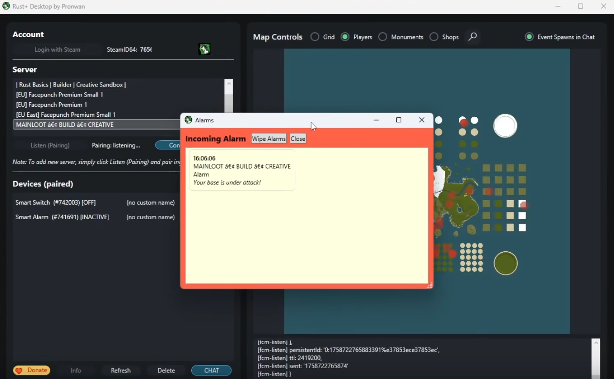

[](https://discord.gg/G5TVPsqXQq)

# RustPlusDesk - Panda Edition

RustPlusDesk is an unofficial Windows desktop app for Rust+ Companion.

It helps you pair Rust servers, monitor events, control Smart Devices, view team chat, track players, and work with the live map from your PC.

This fork is maintained by Panda at [LazyPandax/rust-](https://github.com/LazyPandax/rust-) and uses GitHub Releases for update metadata and installer downloads.

> This project is not affiliated with Facepunch Studios or Rust.

## Latest Release

**Current version: v5.0.7**

[Open latest release](https://github.com/LazyPandax/rust-/releases/latest)

Download `RustPlusDesk-Setup.exe` from the latest release and run it.

### Recent Updates

**v5.0.7 - Update installer fix**

- Starts the verified setup file after an update download.
- Closes RustPlusDesk before setup replaces installed files.
- Bypasses close-to-tray during update shutdown so the upgrade does not loop.

**v5.0.6 - Account, updater, and overlay cleanup**

- Added a Steam unlink/logout button.
- Fixed private GitHub release checks with a protected local token store.
- Added clearer update diagnostics for missing token or repository access.
- Overlay remote sync is now optional; without sync config, overlays save locally.

**v5.0.0 - Panda Edition foundation**

- Bundled runtime handling for Node.js and Rust+ listener tools.
- Update download progress and installer verification.
- Cleaner patch notes and support links.
- Continued map, device, chat, player tracking, and overlay improvements from the earlier desktop builds.

Older v2-v4 update notes were removed from the README front page to keep the repository clean. Use the [GitHub Releases page](https://github.com/LazyPandax/rust-/releases) for release history.

## Main Features

- Pair Rust servers through Steam and the Rust+ Companion flow.
- Connect to paired Rust servers from Windows.
- Monitor Patrol Helicopter, Cargo Ship, Chinook, Oil Rig crate timers, and other map events.
- Control Smart Switches and Smart Devices.
- Import, group, and share Smart Devices with teammates.
- Track Storage Monitors and upkeep.
- View team chat and send event notifications.
- Search vending machines and analyze trade routes.
- Track players with activity history and online status.
- Use map overlays, mini map, crosshair overlay, and custom crosshairs.
- Use bundled runtime files, so normal users do not need to install Node.js manually.

## Installation

1. Open the [latest release](https://github.com/LazyPandax/rust-/releases/latest).
2. Download `RustPlusDesk-Setup.exe`.
3. Run the installer.
4. Launch RustPlusDesk.
5. Use the pairing button to register Rust+ Companion and link Steam.
6. In Rust, use the Rust+ pairing option for the server you want to connect.

## Private Update Access

If this repository is private, update checks need a GitHub token with read access to `LazyPandax/rust-`.

Supported options:

- Set `RUSTPLUSDESK_GITHUB_TOKEN`.
- Or put the token once in `%APPDATA%\RustPlusDesk\github-token.txt`.

RustPlusDesk imports the token into a DPAPI-protected file and removes the plaintext import file.

To use a different release repository, set:

```text
RUSTPLUSDESK_UPDATE_REPO=owner/repo
```

Or put `owner/repo` in:

```text
%APPDATA%\RustPlusDesk\github-release-repo.txt
```

## Overlay Sync

Remote overlay sync is optional.

Without remote sync settings, overlays are saved locally only.

To enable remote sync, configure:

```text
RUSTPLUS_DESK_OVERLAY_SYNC_URL
RUSTPLUS_DESK_OVERLAY_SYNC_SECRET_HEX
```

Or place the values in:

```text
%APPDATA%\RustPlusDesk\overlay-sync-url.txt
%APPDATA%\RustPlusDesk\overlay-sync-secret-hex.txt
```

## Pairing Help

If normal pairing fails:

1. Restart RustPlusDesk.
2. Right-click the pairing button.
3. Try the alternate browser pairing option.
4. If needed, choose the delete config / re-pair option.

If the listener still will not start, delete:

```text
%APPDATA%\RustPlusDesk\rustplusjs-config.json
```

Then launch RustPlusDesk and pair again.

### Manual Pairing

Run this from the RustPlusDesk install folder in PowerShell:

```powershell
$node = ".\runtime\node-win-x64\node.exe"
$cli  = "$env:LOCALAPPDATA\RustPlusDesk\runtime\rustplus-cli\node_modules\@liamcottle\rustplus.js\cli\index.js"
$cfg  = "$env:APPDATA\RustPlusDesk\rustplusjs-config.json"

if (!(Test-Path $cli)) {
    $zip = ".\runtime\rustplus-cli.zip"
    $dst = "$env:LOCALAPPDATA\RustPlusDesk\runtime\rustplus-cli"
    New-Item -ItemType Directory -Force -Path $dst | Out-Null
    Expand-Archive -Path $zip -DestinationPath $dst -Force
}

& $node $cli fcm-register --config-file "$cfg"
```

## Known Issues

- Some older UI text may still be mixed between English and German.
- Switching servers very quickly can interrupt the listener.
- Hovering many shop markers at the same time can make tooltips flicker.

Please report issues in the [Issues page](https://github.com/LazyPandax/rust-/issues).

## Screenshots



